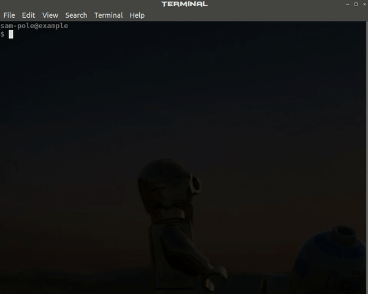

# CPSM - Competitive Programming Solutions Manager

<p align="center">

</p>

## Overview

<!-- toc -->

- [Installation](#installation)
- [Usage](#usage)
  - [Examples](#examples)
- [Customization](#customization)
  - [cpsm_config.py](#cpsm_configpy)
- [Uninstallation](#uninstallation)
- [Contributing](#contributing)
- [TODO](#todo)
- [Credits](#credits)

<!-- tocstop -->

CPSM is a tool for managing solutions to programming problems, particularly
competitive programming problems. It allows one to easily create and save new
solution files from templates.

CPSM assumes that, in a given directory, you have several directories holding
solutions to problems. Furthermore, within each directory, there should be a
`solving` directory holding problems that you are working on. Thus, the
structure should look something like this:

```
.
├── cpsm_config.py             <-- configuration file
├── website-1
│   ├── solution1.cpp
│   ├── solution2.py
│   ├── ...
│   └── solving
│       ├── solving1.cpp
│       └── solving2.py
└── website-2
    ├── solution1.cpp
    ├── solution2.py
    ├── ...
    └── solving
        ├── solving1.cpp
        └── solving2.py
```

Then, when you decide to save a file, it moves from the solving directory to its
main directory.

## Installation

CPSM requires Python 3.6 or later (compatibility with earlier versions may be
coming soon, however). To install, start by cloning this repo. Then, while in
the repo, do:

```
pip install -e .
```

Make sure you use the `-e` option! If you do not, Jinja will not be able to read
the templates. Now, you should be able to run the command `cpsm`.

In a directory where you want to create solutions, do

```
cpsm init
```

This will walk you through a few steps and eventually create a `cpsm_config.py`
file with your configuration. You can modify this `cpsm_config.py` file as you
wish, as long as you retain at least the original variables, as they are needed
by cpsm.

## Usage

```
USAGE: cpsm MODE [ARGS...]
  cpsm init | Initialize a directory for CPSM
  cpsm n abbrev problem template | Create a new solution (or open existing)
  cpsm r abbrev problem filetype | Run a solution
  cpsm s abbrev problem filetype | Save an existing solution
  cpsm h | Display this help message
```

### Examples

Create a new solution for the HackerRank problem `Journey to the Moon` using the
`cpp` template, where the abbreviation for HackerRank is `hr` and the directory
for it is hackerrank. Note that the template need not be named `cpp`; it just so
happens that the template name matches the file extension here.

```
cpsm n hr "Journey to the Moon" cpp
```

This creates a journey-to-the-moon.cpp and journey-to-the-moon.txt file in the
hackerrank/solving directory and opens up an editor where you can work on the
files. _Note that if any of these files exist already, they will simply be
opened._

While coding, you can run your solution with the input file by doing:

```
cpsm r hr "Journey to the Moon" cpp
```

Behind the scenes, this uses `g++` to compile journey-to-the-moon.cpp to create
a journey-to-the-moon.out file in the hackerrank/solving directory and runs it
with journey-to-the-moon.txt as input.

Once you are done, you can move the files to the main hackerrank directory (i.e.
"save" them) with the following command. If your configuration file allows it,
the files will also be added and committed to the git repo. A prompt will be
provided if these files already exist in the directory.

```
cpsm s hr "Journey to the Moon" cpp
```

Note that you do not need quotes around your problem title if your problem title
has no spaces. For example, you can do `cpsm n uva 12345 cpp`.

## Customization

### cpsm_config.py

Configurations for CPSM are handled in a `cpsm_config.py` file, which is created
upon running `cpsm init`. An example is shown below.

You can change the `cpsm_config.py` file at any time, as long as you maintain at
least the original variables, since they are used in CPSM. Here are some common
ways you might modify the file:

- **Adding a template** - You can do this by adding an entry into the
  `templates` variable. You will need to provide the name of the template, the
  `filetype` that it is for, and the `code` used for it.
  - The `code` is a [Jinja](http://jinja.pocoo.org/docs/2.10/) template. You can
    add "template variables" into it by putting them in double curly braces,
    e.g. `{{ variable }}`. Then, you can define these variables in the
    `mappings` variable.
- **Adding an abbreviation** - Modify the `abbreviations` variable, providing
  the `name` and `dir` along with the new abbreviation.
- **Adding a new filetype for running** - Modify the `run_commands` variable,
  providing a list of commands to run for the filetype.

```python
# Configuration file for CPSM

# Command to run for opening the files when starting a new solution
editor = "vim -p"

# Should CPSM open the input file along with the code file? This is particularly
# useful if your editor does not support files
open_input = True

# When saving, should CPSM add and commit the files to git? You can choose to
# do this for one, both, or none of the code and input files
save_code_to_git = {{ save_code_to_git }}
save_input_to_git = {{ save_input_to_git }}

# Abbreviations for directories and full names of websites/competitions/etc.
# Abbreviations should be of the following form:
#   "(abbrev)": {
#       "name": "(full name of website/competition/etc)",
#       "dir": "(name of directory)",
#   },
abbreviations = {
"hr": {
        "name": "HackerRank",
        "dir": "hackerrank",
    },
}

# Mapping of strings that can be inserted into the templates below. Note that
# the following keys are reserved for use by CPSM:
#   "name" - the name of the website/competition/etc for the problem
#   "problem_name" - the title of the problem
# If you include these keys, they simply will not be used.
mappings = {
    "username": "anonymous",
    "fullname": "Anonymous Sample",
}

# Mapping of template names. Each template should be of the following form:
#   "(template name)": {
#       "filetype": "(file extension to use with this template)",
#       "code": "(code for the template)",
#   },
# Substitution in the code is done using Jinja's Template.render(), with the
# mappings above. In short, you can represent variables from the mappings above
# by putting them in double curly braces, e.g. {{ variable }}. Refer to the
# Jinja docs at http://jinja.pocoo.org/docs/2.10/ for more info.
templates = {
    "cpp": {
        "filetype": "cpp",
        "code":
        """\
// Author: {{username}} ({{fullname}})
// Problem: ({{name}}) {{problem_name}}
#include <bits/stdc++.h>
#define GET(x) scanf("%d", &x)
#define GED(x) scanf("%lf", &x)
typedef long long ll;
using namespace std;
typedef pair<int, int> ii;

int main() {

  return 0;
}
""",
    },
    "cpp-blank": {
        "filetype": "cpp",
        "code":
        """\
// Author: {{username}} ({{fullname}})
// Problem: ({{name}}) {{problem_name}}
""",
    },
    "py": {
        "filetype": "py",
        "code":
        """\
# Author: {{username}} ({{fullname}})
# Problem: ({{name}}) {{problem_name}}

import sys
from collections import defaultdict

""",
    },
    "py-blank": {
        "filetype": "py",
        "code":
        """\
# Author: {{username}} ({{fullname}})
# Problem: ({{name}}) {{problem_name}}
""",
    },
}

# A mapping of filetypes to a list of commands that should be run during run
# mode. Each command should be of the form:
#   "(filetype)": {
#       ["(command 1)", "(command 2)", ...],
#   },
# Each command is interpreted as a jinja template, and there is only one
# variable, "problem_name", that is used during substitution. "problem_name"
# consists of the filename of the problem, with directories prepended to it.
run_commands = {
    "cpp": [
        "g++ {{ problem_name }}.cpp -o {{ problem_name }}.out",
        "{{ problem_name }}.out < {{ problem_name }}.txt",
    ],
    "py": [
        "python {{ problem_name }}.py < {{ problem_name }}.txt",
    ],
}
```

## Uninstallation

Should you ever decide to uninstall cpsm :scream:, simply run:

```
pip uninstall cpsm
```

You may also want to remove your `cpsm_config.py` files if you are truly done
with CPSM.

## Contributing

See [CONTRIBUTING.md](CONTRIBUTING.md).

## TODO

CPSM is under (heavy) development. Here are some remaining tasks, in order of
priority:

1. Update GIF with new features
1. Check for existing input files in the main directory before creating a new
   one (and query the user to see if they would like to use that file).
1. Create a PyPI package
1. Enable compatibility with earlier Python (down to 3.4-3.5?), mainly by
   eliminating f-strings
1. Make a website on Github Pages - or a readthedocs page
1. Integrate testing? [shUnit](https://github.com/kward/shunit2)

## Credits

- [Kevin Wang](https://github.com/vitamintk), for encouraging me to push this to
  a full project
- [Tianjiao Huang](https://github.com/gitletH), for being a pre-pre-pre-beta tester and suggesting the use
  of Jinja
